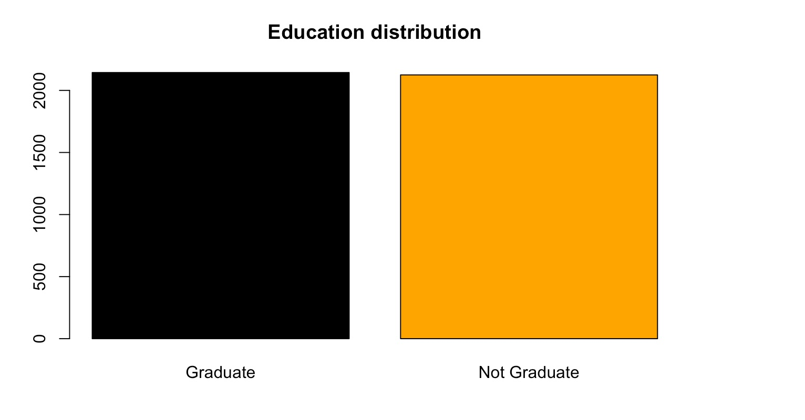

<table style="font-family: Arial, sans-serif; font-size: 16px;">
  <tbody><tr>
    <th><b>Attribute</b></th>
    <th><b>Description</b></th>
  </tr>
  <tr>
    <td><b>loan_id</b></td>
    <td>The unique identification number of each sample.</td>
  </tr>
  <tr>
    <td><b>no_of_dependents</b></td>
    <td>The number of dependents of the applicant.</td>
  </tr>
  <tr>
    <td><b>education</b></td>
    <td>The edducation level of the applicant, either <b>Graduate</b> or <b>Not Graduate</b>.</td>
  </tr>
  <tr>
      <td><b>self_employed</b></td>
      <td>Either if the applicant is self employed or not.</td>
    </tr>
  <tr>
      <td><b>income_annum</b></td>
      <td>The annual income of the applicant.</td>
    </tr>
  <tr>
      <td><b>loan_amount</b></td>
      <td>The total amount requested for the loan.</td>
    </tr>
  <tr>
      <td><b>loan_term</b></td>
      <td>The duration, in years, within which the loan must be repaid.</td>
    </tr>
  <tr>
      <td><b>cibil_score</b></td>
      <td>Credit score of the applicant.</td>
    </tr>
  <tr>
      <td><b>residential_assets_value</b></td>
      <td>The total value of the applicant's residential assets.</td>
    </tr>
  <tr>
      <td><b>commercial_assets_value</b></td>
      <td>The total value of the applicant's commercial assets.</td>
    </tr>
 <tr>
      <td><b>luxury_assets_value</b></td>
      <td>The total value of the applicant's luxury assets.</td>
    </tr>
 <tr>
      <td><b>bank_asset_value</b></td>
      <td>The total value of the applicant's bank assets.</td>
    </tr>
 <tr>
      <td><b>loan_status</b></td>
      <td>Target variable. Describes whether the loan was approved or not.</td>
    </tr>
</tbody></table>

```{r}
library(readr)
loan_approval <- read_csv("loan_approval_dataset.csv")
print(loan_approval)
```

## 1. Exploratory analysis

First, we'll make a brief overview to get the idea of the dataset we work with.

### Categorical data

1. Education values distribution
```{r}
freq = table(loan_approval$education)
r_freq = round(freq/nrow(loan_approval), digits = 2)
p_freq = round(r_freq*100, digits = 2)

cbind(freq, r_freq, p_freq)

barplot(freq, col=c("black", "orange"), main = "Education distribution")
```



2. Self-employed values distribution
```{r}
freq = table(loan_approval$self_employed)
r_freq = round(freq/nrow(loan_approval), digits = 2)
p_freq = round(r_freq*100, digits = 2)

cbind(freq, r_freq, p_freq)
barplot(freq, main = "Self employed distribution", col=c("black", "orange"))
```


3. Loan status values distribution
```{r}
freq = table(loan_approval$loan_status)
r_freq = round(freq/nrow(loan_approval), digits = 2)
p_freq = round(r_freq*100, digits = 2)

cbind(freq, r_freq, p_freq)
barplot(freq, main = "Loan status distribution", col=c("black", "orange"))

```


### Continious data

4. Number of dependants values distribution

To get table of frequencies
```{r}
freq = table(loan_approval$no_of_dependents)
r_freq = round(freq/nrow(loan_approval), digits = 2)
p_freq = round(r_freq*100, digits = 2)

cbind(freq, r_freq, p_freq)
```

```{r}
a = barplot(freq, main="Number of dependents", ylim = c(0, max(freq)+50), col=c("lightgray", "gray"))
abline(h=0)
text(a, freq - 100, labels = freq, pos = 3, cex = 0.8, col = "black")
```


5. Loan term values distribution
```{r}
df = loan_approval$loan_term

cbind(summary(df))

freq = table(df)
cbind(freq)

a = barplot(freq, main="Loan term distribution", ylim = c(0, max(freq)+50), xlab = "Loan term", ylab = "Frequency", col=c("lightgray", "gray"))
abline(h=0)
text(a, freq - 100, labels = freq, pos = 3, cex = 0.8, col = "black")
```


6. Income amount values distribution
```{r}
df = loan_approval$income_annum/1000 # In thousands
cbind(summary(df))
bins = seq(0, 10000, 500) # split into 20 bins with step of 500 (thousand)

data = cut(df, bins)

freq = table(data)
cbind(freq)

hist(df, breaks = bins, xlab = "Income", ylab = "Frequency of incomes", main = "Annual income distribution (in thousands)", axes = FALSE, labels = TRUE, ylim = c(0,300), col=c("lightgray", "gray"))
axis(side = 1, at = bins, labels = bins, las = 2)
axis(side = 2)
```


7. Loan amount values distribution
```{r}
df = loan_approval$loan_amount/1000

cbind(summary(df))

bins = seq(0, 40000, 2000) # split into 20 bins with step of 2000 (thousand)
data = cut(df, bins)

freq = table(data)
cbind(freq)


hist(df, breaks = bins, xlab = "Loan amount", ylab = "Frequency of loan amounts", main = "Loan amount distribution (in thousands)", axes = FALSE, col=c("lightgray", "gray"))
axis(side = 1, at = bins, labels = bins, las = 2)
axis(side = 2)
```


8. CIBIL score values distribution
```{r}
df = loan_approval$cibil_score

cbind(summary(df))

bins = seq(300, 900, 30) # split into 20 bins with step of 30
data = cut(df, bins)

freq = table(data)
cbind(freq)

hist(df, breaks = bins, xlab = "CIBIL score range", ylab = "Frequency of CIBIL score", main = "Distribution od CIBIL scores", axes = FALSE, col=c("lightgray", "gray"))
axis(side = 1, at = bins, labels = bins, las = 2)
axis(side = 2)
```


9. Residential assets values distribution
```{r}
df = loan_approval$residential_assets_value/1000
cbind(summary(df))
bins = seq(-500, 30000, 500) # split into 61 bins with step of 500 (thousand) just to display the negative assets

data = cut(df, bins)

freq = table(data)
data.frame(freq) # cbind returns a too long column


hist(df, breaks = bins, xlab = "Res. assets value in thousands", ylab = "Frequency of values", main = "Res. assets values distribution", axes = FALSE, col=c("lightgray", "gray"))
axis(side = 1, at = bins, labels = bins, las = 2)
axis(side = 2)
```


10. Commercial assets values distribution
```{r}
df = loan_approval$commercial_assets_value/1000
cbind(summary(df))
bins = seq(0, 20000, 1000) # split into 20 bins with step of 1000 (thousand)

data = cut(df, bins)

freq = table(data)
data.frame(freq)

hist(df, breaks = bins, xlab = "Comm. assets value in thousands", ylab = "Frequency of values", main = "Comm. assets values distribution", axes = FALSE, col=c("lightgray", "gray"))
axis(side = 1, at = bins, labels = bins, las = 2)
axis(side = 2)
```


11. Luxury assets values distribution
```{r}
df = loan_approval$luxury_assets_value/1000
cbind(summary(df))
bins = seq(0, 40000, 2000) # split into 20 bins with step of 2000 (thousand)

data = cut(df, bins)

freq = table(data)
data.frame(freq)

hist(df, breaks = bins, xlab = "Lux. assets value in thousands", ylab = "Frequency of values", main = "Lux. assets values distribution", axes = FALSE, col=c("lightgray", "gray"))
axis(side = 1, at = bins, labels = bins, las = 2)
axis(side = 2)
```


12. Bank assets values distribution
```{r}
df = loan_approval$bank_asset_value/1000
cbind(summary(df))

bins = seq(0, 15000, 1000) # split into 20 bins with step of 1000 (thousand)

data = cut(df, bins)

freq = table(data)
data.frame(freq)

hist(df, breaks = bins, xlab = "Bank assets value in thousands", ylab = "Frequency of values", main = "Bank assets values distribution", axes = FALSE, col=c("lightgray", "gray"))
axis(side = 1, at = bins, labels = bins, las = 2)
axis(side = 2)
```


