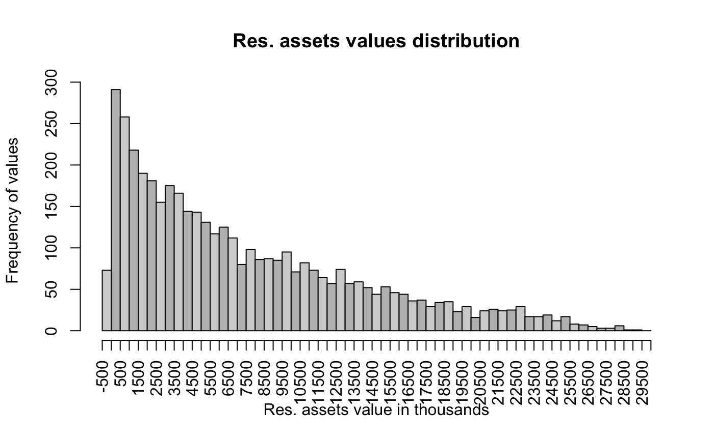

The loan approval [dataset](https://www.kaggle.com/datasets/architsharma01/loan-approval-prediction-dataset/data) is a collection of financial records and associated information used to determine the eligibility of individuals or organizations for obtaining loans from a lending institution. 

Here are the dataset columns with description:

<table style="font-family: Arial, sans-serif; font-size: 16px;">
  <tbody><tr>
    <th><b>Attribute</b></th>
    <th><b>Description</b></th>
  </tr>
  <tr>
    <td><b>loan_id</b></td>
    <td>The unique identification number of each sample.</td>
  </tr>
  <tr>
    <td><b>no_of_dependents</b></td>
    <td>The number of dependents of the applicant.</td>
  </tr>
  <tr>
    <td><b>education</b></td>
    <td>The edducation level of the applicant, either <b>Graduate</b> or <b>Not Graduate</b>.</td>
  </tr>
  <tr>
      <td><b>self_employed</b></td>
      <td>Either if the applicant is self employed or not.</td>
    </tr>
  <tr>
      <td><b>income_annum</b></td>
      <td>The annual income of the applicant.</td>
    </tr>
  <tr>
      <td><b>loan_amount</b></td>
      <td>The total amount requested for the loan.</td>
    </tr>
  <tr>
      <td><b>loan_term</b></td>
      <td>The duration, in years, within which the loan must be repaid.</td>
    </tr>
  <tr>
      <td><b>cibil_score</b></td>
      <td>Credit score of the applicant.</td>
    </tr>
  <tr>
      <td><b>residential_assets_value</b></td>
      <td>The total value of the applicant's residential assets.</td>
    </tr>
  <tr>
      <td><b>commercial_assets_value</b></td>
      <td>The total value of the applicant's commercial assets.</td>
    </tr>
 <tr>
      <td><b>luxury_assets_value</b></td>
      <td>The total value of the applicant's luxury assets.</td>
    </tr>
 <tr>
      <td><b>bank_asset_value</b></td>
      <td>The total value of the applicant's bank assets.</td>
    </tr>
 <tr>
      <td><b>loan_status</b></td>
      <td>Target variable. Describes whether the loan was approved or not.</td>
    </tr>
</tbody></table>

The goal of the project is to practice R and statistical techniques. So, with this in mind we will:
- Perform exploratory analysis
- Check the relationship between two categorical variables
- Test the hypothesis about relationship between categorical and numerical variables
- Build a prediction model with use of numerical and categorical variables.


```{r}
library(readr)
loan_approval <- read_csv("loan_approval_dataset.csv")
print(loan_approval)
```
Top 5 rows:

| loan_id | no_of_dependents | education    | self_employed | income_annum | loan_amount | loan_term | cibil_score | residential_assets_value | commercial_assets_value | luxury_assets_value | bank_asset_value | loan_status |
|---------|------------------|--------------|---------------|--------------|-------------|-----------|-------------|--------------------------|-------------------------|---------------------|------------------|-------------|
| 1       | 2                | Graduate     | No            | 9600000      | 29900000    | 12        | 778         | 2400000                  | 17600000                | 22700000            | 8000000          | Approved    |
| 2       | 0                | Not Graduate | Yes           | 4100000      | 12200000    | 8         | 417         | 2700000                  | 2200000                 | 8800000             | 3300000          | Rejected    |
| 3       | 3                | Graduate     | No            | 9100000      | 29700000    | 20        | 506         | 7100000                  | 4500000                 | 33300000            | 12800000         | Rejected    |
| 4       | 3                | Graduate     | No            | 8200000      | 30700000    | 8         | 467         | 18200000                 | 3300000                 | 23300000            | 7900000          | Rejected    |
| 5       | 5                | Not Graduate | Yes           | 9800000      | 24200000    | 20        | 382         | 12400000                 | 8200000                 | 29400000            | 5000000          | Rejected    |

## 1. Exploratory analysis

First, we'll make a brief overview to get the idea of the dataset we work with.

### Categorical data

1. Education values distribution
```{r}
freq = table(loan_approval$education)
r_freq = round(freq/nrow(loan_approval), digits = 2)
p_freq = round(r_freq*100, digits = 2)

cbind(freq, r_freq, p_freq)

barplot(freq, col=c("black", "orange"), main = "Education distribution")
```


2. Self-employed values distribution
```{r}
freq = table(loan_approval$self_employed)
r_freq = round(freq/nrow(loan_approval), digits = 2)
p_freq = round(r_freq*100, digits = 2)

cbind(freq, r_freq, p_freq)
barplot(freq, main = "Self employed distribution", col=c("black", "orange"))
```


3. Loan status values distribution
```{r}
freq = table(loan_approval$loan_status)
r_freq = round(freq/nrow(loan_approval), digits = 2)
p_freq = round(r_freq*100, digits = 2)

cbind(freq, r_freq, p_freq)
barplot(freq, main = "Loan status distribution", col=c("black", "orange"))

```


### Continious data

4. Number of dependants values distribution

To get table of frequencies
```{r}
freq = table(loan_approval$no_of_dependents)
r_freq = round(freq/nrow(loan_approval), digits = 2)
p_freq = round(r_freq*100, digits = 2)

cbind(freq, r_freq, p_freq)
```
|   | freq | r_freq | p_freq |
|---|------|--------|--------|
| 0 | 712  | 0.17   | 17     |
| 1 | 697  | 0.16   | 16     |
| 2 | 708  | 0.17   | 17     |
| 3 | 727  | 0.17   | 17     |
| 4 | 752  | 0.18   | 18     |
| 5 | 673  | 0.16   | 16     |

```{r}
a = barplot(freq, main="Number of dependents", ylim = c(0, max(freq)+50), col=c("lightgray", "gray"))
abline(h=0)
text(a, freq - 100, labels = freq, pos = 3, cex = 0.8, col = "black")
```


5. Loan term values distribution
```{r}
df = loan_approval$loan_term

cbind(summary(df))

freq = table(df)
cbind(freq)

a = barplot(freq, main="Loan term distribution", ylim = c(0, max(freq)+50), xlab = "Loan term", ylab = "Frequency", col=c("lightgray", "gray"))
abline(h=0)
text(a, freq - 100, labels = freq, pos = 3, cex = 0.8, col = "black")
```


6. Income amount values distribution
```{r}
df = loan_approval$income_annum/1000 # In thousands
cbind(summary(df))
bins = seq(0, 10000, 500) # split into 20 bins with step of 500 (thousand)

data = cut(df, bins)

freq = table(data)
cbind(freq)

hist(df, breaks = bins, xlab = "Income", ylab = "Frequency of incomes", main = "Annual income distribution (in thousands)", axes = FALSE, labels = TRUE, ylim = c(0,300), col=c("lightgray", "gray"))
axis(side = 1, at = bins, labels = bins, las = 2)
axis(side = 2)
```


7. Loan amount values distribution
```{r}
df = loan_approval$loan_amount/1000

cbind(summary(df))

bins = seq(0, 40000, 2000) # split into 20 bins with step of 2000 (thousand)
data = cut(df, bins)

freq = table(data)
cbind(freq)


hist(df, breaks = bins, xlab = "Loan amount", ylab = "Frequency of loan amounts", main = "Loan amount distribution (in thousands)", axes = FALSE, col=c("lightgray", "gray"))
axis(side = 1, at = bins, labels = bins, las = 2)
axis(side = 2)
```


8. CIBIL score values distribution
```{r}
df = loan_approval$cibil_score

cbind(summary(df))

bins = seq(300, 900, 30) # split into 20 bins with step of 30
data = cut(df, bins)

freq = table(data)
cbind(freq)

hist(df, breaks = bins, xlab = "CIBIL score range", ylab = "Frequency of CIBIL score", main = "Distribution od CIBIL scores", axes = FALSE, col=c("lightgray", "gray"))
axis(side = 1, at = bins, labels = bins, las = 2)
axis(side = 2)
```


9. Residential assets values distribution
```{r}
df = loan_approval$residential_assets_value/1000
cbind(summary(df))
bins = seq(-500, 30000, 500) # split into 61 bins with step of 500 (thousand) just to display the negative assets

data = cut(df, bins)

freq = table(data)
data.frame(freq) # cbind returns a too long column


hist(df, breaks = bins, xlab = "Res. assets value in thousands", ylab = "Frequency of values", main = "Res. assets values distribution", axes = FALSE, col=c("lightgray", "gray"))
axis(side = 1, at = bins, labels = bins, las = 2)
axis(side = 2)
```



10. Commercial assets values distribution
```{r}
df = loan_approval$commercial_assets_value/1000
cbind(summary(df))
bins = seq(0, 20000, 1000) # split into 20 bins with step of 1000 (thousand)

data = cut(df, bins)

freq = table(data)
data.frame(freq)

hist(df, breaks = bins, xlab = "Comm. assets value in thousands", ylab = "Frequency of values", main = "Comm. assets values distribution", axes = FALSE, col=c("lightgray", "gray"))
axis(side = 1, at = bins, labels = bins, las = 2)
axis(side = 2)
```


11. Luxury assets values distribution
```{r}
df = loan_approval$luxury_assets_value/1000
cbind(summary(df))
bins = seq(0, 40000, 2000) # split into 20 bins with step of 2000 (thousand)

data = cut(df, bins)

freq = table(data)
data.frame(freq)

hist(df, breaks = bins, xlab = "Lux. assets value in thousands", ylab = "Frequency of values", main = "Lux. assets values distribution", axes = FALSE, col=c("lightgray", "gray"))
axis(side = 1, at = bins, labels = bins, las = 2)
axis(side = 2)
```


12. Bank assets values distribution
```{r}
df = loan_approval$bank_asset_value/1000
cbind(summary(df))

bins = seq(0, 15000, 1000) # split into 20 bins with step of 1000 (thousand)

data = cut(df, bins)

freq = table(data)
data.frame(freq)

hist(df, breaks = bins, xlab = "Bank assets value in thousands", ylab = "Frequency of values", main = "Bank assets values distribution", axes = FALSE, col=c("lightgray", "gray"))
axis(side = 1, at = bins, labels = bins, las = 2)
axis(side = 2)
```


Table of correlations, correlation plot

```{r}
correlations = cor(loan_approval[, c("no_of_dependents", "loan_term", "income_annum", "loan_amount", "residential_assets_value", "commercial_assets_value", "luxury_assets_value",  "bank_asset_value", "cibil_score")])
round(correlations, digits = 4)
```


|                          | no_of_dependents | loan_term | income_annum | loan_amount | residential_assets_value | commercial_assets_value | luxury_assets_value | bank_asset_value | cibil_score |
|--------------------------|------------------|-----------|--------------|-------------|--------------------------|-------------------------|---------------------|------------------|-------------|
| no_of_dependents         | 1.00             | -0.02     | 0.01         | 0.00        | 0.01                     | 0.00                    | 0.00                | 0.01             | -0.01       |
| loan_term                | -0.02            | 1.00      | 0.01         | 0.01        | 0.01                     | -0.01                   | 0.01                | 0.02             | 0.01        |
| income_annum             | 0.01             | 0.01      | 1.00         | 0.93        | 0.64                     | 0.64                    | 0.93                | 0.85             | -0.02       |
| loan_amount              | 0.00             | 0.01      | 0.93         | 1.00        | 0.59                     | 0.60                    | 0.86                | 0.79             | -0.02       |
| residential_assets_value | 0.01             | 0.01      | 0.64         | 0.59        | 1.00                     | 0.41                    | 0.59                | 0.53             | -0.02       |
| commercial_assets_value  | 0.00             | -0.01     | 0.64         | 0.60        | 0.41                     | 1.00                    | 0.59                | 0.55             | 0.00        |
| luxury_assets_value      | 0.00             | 0.01      | 0.93         | 0.86        | 0.59                     | 0.59                    | 1.00                | 0.79             | -0.03       |
| bank_asset_value         | 0.01             | 0.02      | 0.85         | 0.79        | 0.53                     | 0.55                    | 0.79                | 1.00             | -0.02       |
| cibil_score              | -0.01            | 0.01      | -0.02        | -0.02       | -0.02                    | 0.00                    | -0.03               | -0.02            | 1.00        |

Now, the correlation plot

```{r}
library(psych)
gr = colorRampPalette(c('orange', 'black'))

corPlot(correlations,
        n =10,
        cex = 0.7,
        zlim = c(-0.1,1),
        upper = FALSE,
        xlas = 2,
        cex.axis = 0.7,
        gr = gr)
```


Quick overview inferences:

We can't see the normal distribution of the data in any variable.

There are a lot of correlations between many variables like income and assets or loan amount. But mostly these things are more or less expected: the more income a person has the more things they have like luxury or properties, or bank assets. And more likely a person with a higher income will get the loan approved. Interesting thing is to explore the correlations between not so obviouse vars, and make models involving the categorical variables. Like what role does the education has here? Does it make any impact on the decision to approve or not the loan? On amount? And self-employment - is it a positive factor or a factor of risk?


## 2. Calculate Self employment / Loan approval status correlation.

Suppose, we suspect the self employed customers have somewhat higher chances of getting the loan approved.
This part is interesting because both variables are categorical.

H_0: there's no dependency between these two variables. 
H_A: there's a dependency between the self employment status and loan approval status. 

1.  Calculate the number of Yes and No in Self-employment

```{r}
Yes=sum(loan_approval$self_employed=="Yes")
n=length(loan_approval$self_employed)

percent_yes = round((Yes/n)*100, digits = 2)
percent_no = 100 - percent_yes
cat("Total Yes:", Yes, percent_yes, "%","\n","Total No:", n-Yes, percent_no, "%")
```
```
Total Yes: 2150 50 % 
Total No:  2119 50 %
```
2.  Calculate the same for Loan Status column
```{r}
Approved=sum(loan_approval$loan_status=="Approved")

percent_appr = round((Approved/n)*100, digits = 2)
percent_rej = 100 - percent_appr


cat("Approved or Rejected loans:","\n","- Total Approved:", Approved, percent_appr, "%","\n","- Total Rejected:", n-Approved, percent_rej, "%")
```

Approved or Rejected loans: 
```
Total Approved: 2656 62 % 
Total Rejected: 1613 38 %
```

3.  I want to know how many of self_employed "yes" got loan_status "approved"

```{r}

joint_table = table(loan_approval$self_employed, loan_approval$loan_status)
rownames(joint_table) = c("Self employed: No", "Self employed: Yes")
colnames(joint_table) = c("Loan approved", "Loan rejected")
print(joint_table)
```
|                    | Loan approved | Loan rejected |
|--------------------|---------------|---------------|
| Self employed: No  | 1318          | 801           |
| Self employed: Yes | 1338          | 812           |

Well, from the table it's seen that there's no correlation between these two. But anyway, to make the task complete, we'll plot the result and perform the p-value test.

4.  Plot the chi square

```{r}
library(ggplot2)

self_loan = table(loan_approval$self_employed, loan_approval$loan_status)
result = chisq.test(self_loan)
print(result)

ggplot(as.data.frame(as.table(self_loan)), aes(x = Var1, y = Var2, fill = Freq)) +
  geom_tile() +
  scale_fill_gradient(low = "orange", high = "black") +
  labs(title = "Observed Frequencies Heatmap")

```


This plot graphically repeats the table result: there's almost no difference between the self-employment (y/n) and loan approval status (Rejected/Approved).

5.  Get p-value

```{r}
chisq.test(joint_table)
```

      	  Pearson's Chi-squared test with Yates' continuity correction
    data:  joint_table
    X-squared = 0, df = 1, p-value = 1


p-value = 1, we cannot reject H_0 that there's no relationship between the two variables.

**Conclusion:** 
There's no evidence that the Self employment status visibly affects the decision on the loan. The Self-employed customers receive the loan just slightly more often than non self-employed.


## 3. Hypothesis test: graduated get more loan amount than not graduated

H_0: there's no dependency between these two variables, loan amount is not dependent on the education level. r^2 = 0 
H_A: customers with degree get loan amount higher than those who do not have a degree. r^2 \> 0

The purpose of this part is to try to find a way to measure dependency between categorical and numerical data.

```{r}
case2 = data.frame(loan_approval[, c("education", "loan_amount")])
```


For the linear regression model with categorical variable we'll first add a column with dummy for education. Graduate = 1, Not Graduate = 0

```{r}
case2$elevel = ifelse(case2$education == "Graduate", 1, 0)
M3 = lm(loan_amount~elevel, case2)
summary(M3)
```

The output:

```
Call:
lm(formula = loan_amount ~ elevel, data = case2)

Residuals:
      Min        1Q    Median        3Q       Max 
-14929151  -7436894   -536894   6363106  24270849 

Coefficients:
            Estimate Std. Error t value            Pr(>|t|)    
(Intercept) 15036894     196190   76.64 <0.0000000000000002 ***
elevel        192257     276839    0.69                0.49    
---
Signif. codes:  0 ‘***’ 0.001 ‘**’ 0.01 ‘*’ 0.05 ‘.’ 0.1 ‘ ’ 1

Residual standard error: 9040000 on 4267 degrees of freedom
Multiple R-squared:  0.000113,	Adjusted R-squared:  -0.000121 
F-statistic: 0.482 on 1 and 4267 DF,  p-value: 0.487
```
**Conclusion:**
With the p-value of 0.49, R-squared as low as 0.0001 we conclude that the education is not significant for this model.

## 4. Predict the loan amount based on the income and degree.

```{r}
case3 = data.frame(loan_approval[, c("education", "income_annum","loan_amount")])
```
For the final equation to make sense, we will denote the "Graduate" as 0 and "No Graduate" as 1.

```{r}
case3$elevel = ifelse(case3$education == "Graduate", 0, 1)
head(case3, 5)
```
| education    | income_annum | loan_amount | elevel |
|--------------|--------------|-------------|--------|
| Graduate     | 9600000      | 29900000    | 0      |
| Not Graduate | 4100000      | 12200000    | 1      |
| Graduate     | 9100000      | 29700000    | 0      |
| Graduate     | 8200000      | 30700000    | 0      |
| Not Graduate | 9800000      | 24200000    | 1      |

```{r}
M4 = lm(loan_amount~income_annum+elevel,case3)
summary(M4)
```

The output:

```
Call:
lm(formula = loan_amount ~ income_annum + elevel, data = case3)

Residuals:
     Min       1Q   Median       3Q      Max 
-9700438 -1966016   -10769  2035162  9902291 

Coefficients:
                Estimate  Std. Error t value            Pr(>|t|)    
(Intercept)   14302.2663 118976.0721    0.12                0.90    
income_annum      2.9882      0.0184  162.01 <0.0000000000000002 ***
elevel         2729.1305 103534.5220    0.03                0.98    
---
Signif. codes:  0 ‘***’ 0.001 ‘**’ 0.01 ‘*’ 0.05 ‘.’ 0.1 ‘ ’ 1

Residual standard error: 3380000 on 4266 degrees of freedom
Multiple R-squared:  0.86,	Adjusted R-squared:  0.86 
F-statistic: 1.31e+04 on 2 and 4266 DF,  p-value: <0.0000000000000002
```

**Conclusion:**

The equation to predict: 14300 + 2.988 * Income + 2729 * Ed

- For every 1 unit increase in income there's increase in loan amount by 2.988. P-level is low so this is a significant parameter.
- Having a degree adds 2729 to the amount. Education (elevel) is insignificant since the p-level is high.

If a person with a degree and annual income of 4100000 wants to get a loan he can expect to get loan of

14300 + 2.988 * 4100000 + 2729 = 12267829

86% of variance are grouped around the regression line. Thus the model explains it.
A high F-statistic (1.312e+04) with a very low p-value (< 2.2e-16) suggests that at least one of the predictors (income) is related to the response variable.

But this model has to take into account at least loan term.

```{r}
case4 = data.frame(loan_approval[, c("education", "income_annum","loan_amount", "loan_term")])
case4$elevel = ifelse(case4$education == "Graduate", 0, 1)
head(case4, 5)
```

| education    | income_annum | loan_amount | loan_term | elevel |
|--------------|--------------|-------------|-----------|--------|
| Graduate     | 9600000      | 29900000    | 12        | 0      |
| Not Graduate | 4100000      | 12200000    | 8         | 1      |
| Graduate     | 9100000      | 29700000    | 20        | 0      |
| Graduate     | 8200000      | 30700000    | 8         | 0      |
| Not Graduate | 9800000      | 24200000    | 20        | 1      |

Now we'll put that variable into the model:

```{r}
M5 = lm(loan_amount~income_annum+elevel+loan_term,case4)
summary(M5)
```
The output:

```
Call:
lm(formula = loan_amount ~ income_annum + elevel + loan_term, 
    data = case4)

Residuals:
     Min       1Q   Median       3Q      Max 
-9718240 -1957162   -23924  2039646  9905927 

Coefficients:
                Estimate  Std. Error t value            Pr(>|t|)    
(Intercept)   52035.4697 153730.8953    0.34                0.74    
income_annum      2.9883      0.0184  161.98 <0.0000000000000002 ***
elevel         3072.3804 103548.6210    0.03                0.98    
loan_term     -3515.7546   9069.5538   -0.39                0.70    
---
Signif. codes:  0 ‘***’ 0.001 ‘**’ 0.01 ‘*’ 0.05 ‘.’ 0.1 ‘ ’ 1

Residual standard error: 3380000 on 4265 degrees of freedom
Multiple R-squared:  0.86,	Adjusted R-squared:  0.86 
F-statistic: 8.75e+03 on 3 and 4265 DF,  p-value: <0.0000000000000002
```

Equation:

52040 + 2.988 * income +3072 * education - 3516 * term

Which means that If the same person with a degree and annual income of 4100000 wants to get a loan for 5 years he can expect to get loan of
52040 + 2.988 * 4100000 + 3072 - 3516 * 12 = 12288332

P-value indicates that the loan term is a stronger factor than education but still not comparable to income amount.

F-statistic with very small p-value means that the model is statistically significant.
